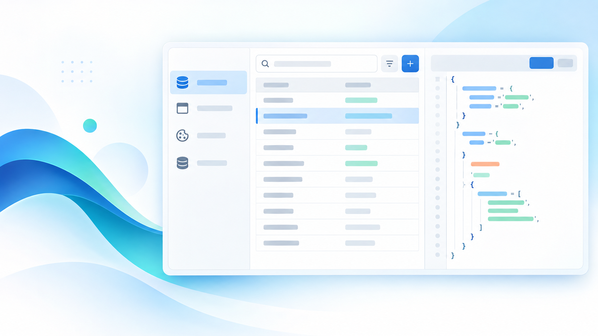

# Browser Storage Inspector

一个面向开发者的浏览器扩展，在当前网站中检查和编辑 **Local Storage、Session Storage、Cookie 与 IndexedDB**。点击工具栏扩展图标，或使用 `Alt+W`，即可打开存储面板。


## 功能

- **Local Storage / Session Storage**：按键浏览、搜索、新增、编辑和删除数据。
- **Cookie**：查看当前页面脚本可访问的 Cookie，并新增、覆盖或删除根路径 Cookie。
- **IndexedDB**：按数据库和对象仓库浏览记录，新增记录，并以 JSON 编辑和保存可序列化的值。
- **快速查找**：搜索 Storage 键名、Cookie 名称和 IndexedDB 主键。
- **JSON 预览**：可解析为 JSON 的 Storage 值可切换格式化预览；预览为只读，不会改写原始值。

### 使用范围

扩展在当前网页上下文中读取数据。浏览器不允许页面脚本读取 `HttpOnly` Cookie，因此这类 Cookie 不会显示；Cookie 管理针对根路径，不覆盖其他 `Path` 范围。IndexedDB 列表最多显示 500 条记录。IndexedDB 编辑器使用 JSON，特殊的非 JSON 结构化克隆值不适合通过文本编辑器往返保存。浏览器内置页面等受限页面无法注入扩展界面。

## 浏览器宣传图

### Microsoft Edge



### Google Chrome


以上为宣传用概念图，用于展示扩展的存储检查与编辑场景。

## 安装与开发

需要 Node.js `20.19` 或更新版本，以及 pnpm `12`。

```sh
pnpm install
pnpm dev
pnpm build
```

构建后，在 Chrome 或 Edge 的扩展管理页面打开**开发者模式**，选择**加载解压缩的扩展**，并选择 `packages/shell-chrome/build` 目录。

## License

[MIT](LICENSE)
