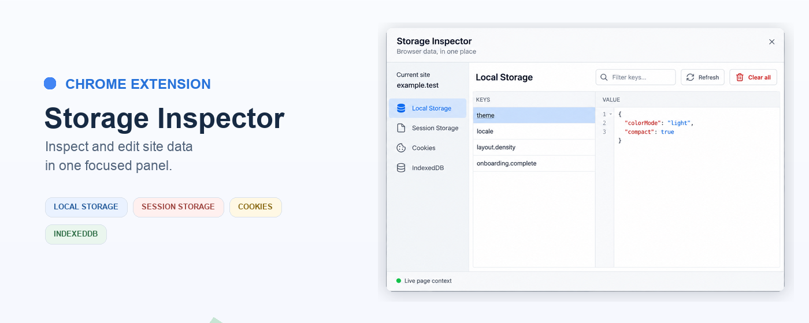
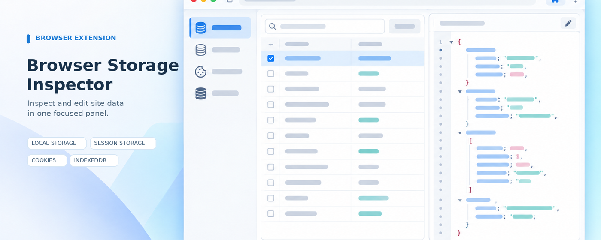
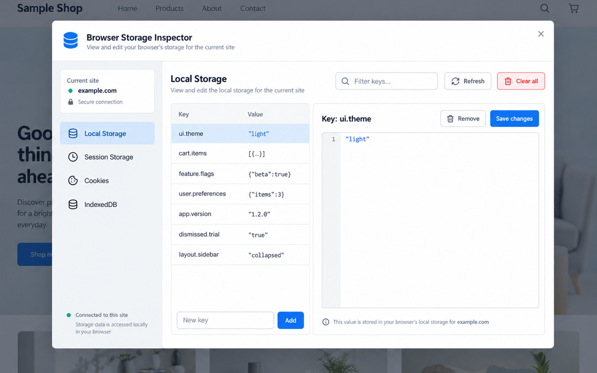

# Browser Storage Inspector

一个面向开发者的浏览器扩展，在当前网站中检查和编辑 **Local Storage、Session Storage、Cookie 与 IndexedDB**。点击工具栏扩展图标，或使用 `Alt+W`，即可打开存储面板。



## 商店链接

- [Microsoft Edge Add-ons](https://microsoftedge.microsoft.com/addons/detail/kiikpnkjmmiaoinieohjgkgmmndgkjlp)
- [Chrome Web Store](https://chromewebstore.google.com/detail/empty-title/dlpdpjghidlefnhlmkdobdaghjjnekpn)

## 功能

- **Local Storage / Session Storage**：按键浏览、搜索、新增、编辑和删除数据。
- **Cookie**：查看当前页面脚本可访问的 Cookie，并新增、覆盖或删除根路径 Cookie。
- **IndexedDB**：按数据库和对象仓库浏览记录，新增记录，并以 JSON 编辑和保存可序列化的值。
- **确认后清理**：可清空当前站点的 Local Storage、Session Storage、可读 Cookie，或所有 IndexedDB 记录；每项操作都会先显示确认提示。
- **快速查找**：搜索 Storage 键名、Cookie 名称和 IndexedDB 主键。
- **JSON 预览**：可解析为 JSON 的 Storage 值可切换格式化预览；预览为只读，不会改写原始值。

### 使用范围

扩展在当前网页上下文中读取数据。浏览器不允许页面脚本读取 `HttpOnly` Cookie，因此这类 Cookie 不会显示；Cookie 管理针对根路径，不覆盖其他 `Path` 范围。IndexedDB 列表最多显示 500 条记录。清理操作只作用于当前站点上下文。IndexedDB 编辑器使用 JSON，特殊的非 JSON 结构化克隆值不适合通过文本编辑器往返保存。浏览器内置页面等受限页面无法注入扩展界面。

## Edge Add-ons listing copy (English)

Inspect and manage the storage used by the site in your current tab. Browse and search Local Storage, Session Storage, page-readable Cookies, and IndexedDB databases, object stores, and records. Add, edit, and remove supported entries from the storage panel. Preview JSON-compatible values in a formatted read-only view, then save supported changes with clear controls. Clear Local Storage, Session Storage, readable Cookies, or IndexedDB data only after an explicit confirmation. Data stays in the current page context and is not sent to a developer server. HttpOnly cookies and cookies outside the supported path are not shown. IndexedDB lists up to 500 records per store, and special structured-clone values that cannot be represented as JSON may not round-trip through the editor. Restricted browser pages cannot be accessed.

## Chrome Web Store listing copy

在当前网页中检查和编辑网站存储数据，适合前端开发与调试。点击扩展图标或使用 `Alt+W` 打开面板。

- 浏览、搜索、新增、编辑、删除和清空当前网站的 Local Storage 与 Session Storage。
- 查看和管理页面脚本可读取的 Cookie，也可清空当前网站可读取的 Cookie。
- 按数据库和对象仓库浏览 IndexedDB 记录，新增、编辑、删除记录，或清空当前网站的 IndexedDB 数据。
- 对可解析为 JSON 的 Storage 值提供只读格式化预览。
- 清空操作会先显示确认提示。

扩展只在当前网页上下文中读取和写入数据，不会将网站存储内容发送到开发者服务器。为支持用户在任意网站上主动检查当前站点，扩展会请求网站访问权限。受浏览器限制，页面脚本无法读取 `HttpOnly` Cookie；Cookie 管理针对根路径；IndexedDB 最多显示 500 条记录，非 JSON 特殊值不适合通过文本编辑器保存。浏览器内置页面等受限页面无法使用扩展面板。

## Privacy

扩展在当前网页上下文中读取和写入网站存储，不会将这些数据发送给开发者或开发者运营的服务器。完整说明见[隐私政策](PRIVACY.md)。

## 浏览器宣传图

### Microsoft Edge



### Google Chrome


Chrome 商店素材独立放在 `media/chrome/`：功能界面图 `screenshot-1.png`（1280 × 800）、小型宣传图 `promo-small.png`（440 × 280）、顶部宣传图 `promo-top.png`（1400 × 560）和图标 `icon-128.png`。界面图使用虚构示例数据。Edge 商店素材保留在 `media/` 根目录：`edge-promo-small.png`（440 × 280）与 `edge-promo-large.png`（1400 × 560）。

Edge 商店图标：`media/300.png`（300 × 300）。商店截图：`media/edge-screenshot.png`（1280 × 800）。



## 安装与开发

需要 Node.js `20.19` 或更新版本，以及 pnpm `12`。

```sh
pnpm install
pnpm dev
pnpm build
```

构建后，在 Chrome 或 Edge 的扩展管理页面打开**开发者模式**，选择**加载解压缩的扩展**，并选择 `packages/shell-chrome/build` 目录。

## License

[MIT](LICENSE)
